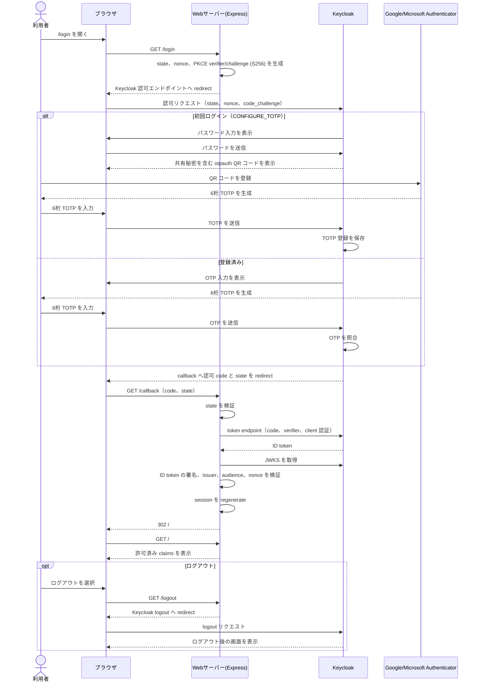

# Keycloak TOTP ログイン・サンプル

ローカル Docker だけで起動する、Keycloak 26.7.0 と Node.js Web アプリの最小 OIDC サンプルです。認可コードフロー + PKCE、サーバーセッション、callback、Keycloak logout を実装しています。

## 起動

PowerShell で実行します。

```powershell
.\scripts\start.ps1
```

macOS または Git Bash (Windows) では、Bash 版を使用します。

```bash
./scripts/start.sh
```

バックグラウンド起動には `./scripts/start.sh --detach`（または `-d`）を使用します。Docker Compose v2 と OpenSSL が必要です。Git Bash では Docker Desktop を起動してから実行してください。

初回だけ `.env` がランダムな管理者パスワード、OIDC client secret、セッション secret とともに生成されます。このファイルは Git 管理されません。起動後に [http://localhost:3000](http://localhost:3000) を開きます。

`docker compose --env-file .env up --build` でも起動できます（あらかじめ `.env.example` をコピーして全値を設定してください）。停止は `docker compose down` です。

バックグラウンドで起動する確認用には `.\scripts\start.ps1 -Detach` を使えます。

## デモログインと TOTP

- ユーザー: `demo`
- パスワード: `.env` の `DEMO_USER_PASSWORD`

このユーザーには realm import で `CONFIGURE_TOTP` required action を設定済みです。初回ログイン時、Keycloak の画面に QR コードが表示されます。Google Authenticator または Microsoft Authenticator で登録してください。登録後の以降のログインではワンタイムコードを要求されます。デモパスワードも `start.ps1` がランダム生成し、Git には保存しません。

## 認証シーケンス



## URL を分ける理由

ブラウザ向けの issuer は `http://localhost:8080/realms/mfa-demo` です。一方 Web コンテナが discovery、JWKS、token endpoint を呼ぶ際は Docker DNS の `http://keycloak:8080/realms/mfa-demo` を使用します。ID token は公開 issuer を `issuer` として厳格に検証します。これによりホストのブラウザから戻り先へ到達でき、同時にコンテナから `localhost` を誤って参照しません。

realm import 中の client secret は `${OIDC_CLIENT_SECRET}` プレースホルダーとして解決されます。Compose は Keycloak にこの値と placeholder 置換の JVM オプションを渡します。

## 表示する認証情報

アプリは検証済み ID token の `sub`、`preferred_username`、`email`、`acr`、`amr` だけを許可リストで表示します。access token、refresh token、client secret、セッション内容は表示・ログ出力しません。realm import では Keycloak 標準の AMR/ACR protocol mapper を ID token に追加しています。ただし claim の存在や値だけで MFA の業務判定を行う前に、実際の authenticator flow（特に外部 IdP 連携時）での値を検証してください。

## テスト

```powershell
npm install
npm test
```

## デプロイ時の注意事項

Compose は公開する両ポートを `127.0.0.1` にバインドします。このサンプルをローカル以外の環境向けに変更する場合は、TLS を終端し、`SESSION_COOKIE_SECURE=true` を設定してください。このローカル HTTP 用の Compose 設定では、意図的に `false` を設定しています。

## テストの制約

ブラウザでの QR 登録、Keycloak のログアウト確認画面、エンドツーエンドの OIDC ログインは手動確認が必要です。自動テストの対象は URL 変換と claim の許可リスト処理のみです。

テストはバックチャネル URL の変換と claim の許可リスト処理を検証します。実ブラウザによる QR 登録は手動確認が必要です。
